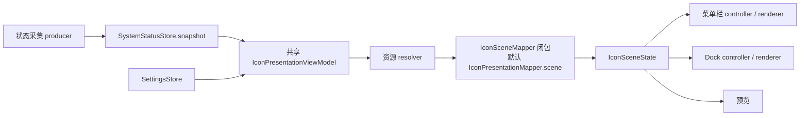

# 三图形展示与更新 API

适用：Status Trio 2.0 presentation refactor 分支；2026-10-01 按代码 `8a79d5d` 核对。本文描述现有实现，供仓库内功能开发、预览和未来插件宿主接入使用。类型名与示例对应当前 Swift 源码；它们目前都是模块内部类型，没有 `public` SDK、插件注册 API、JSON 协议或跨进程调用能力。

## 1. 从哪里接入

| 需求 | 使用入口 | 边界 |
| --- | --- | --- |
| 更新现有电池、网络、音量状态 | 现有 producer → `SystemStatusStore.snapshot` → 共享 `IconPresentationViewModel` | 保留原有监控和状态所有权 |
| 调整图形设置 | `SettingsStore.iconPresentationPublisher` → `IconPresentationConfiguration` | 设置由 SettingsStore 持有，不直接改 renderer |
| 把已知状态映射成三个图形 | `IconPresentationMapper.scene(inputs:configuration:)` | 纯值转换，可用于测试与预览 |
| 绘制自定义场景或预览 | 构造 `IconSceneState` → `StatusIconRenderer` / `DockIconRenderer` | 此入口生成图像，不会自动更新运行中的图标 |
| 将来接入插件 | 宿主适配器 → 明确的状态/映射契约 → 同一个共享 owner | 当前只支持构造时注入映射闭包，没有注册或写入方法 |



三个区域分别为外环 `outerRing`、中心 `center`、底部 `footer`。当前对应电池、连接/音频设备、音量；布局原语不直接依赖这些领域模型。采集者提供状态，Mapper 决定展示，renderer 负责画图。

## 2. 场景值契约

```swift
struct IconSceneState: Equatable, Hashable, Sendable {
    let outerRing: OuterRingState?
    let center: CenterState?
    let footer: FooterState?

    init(
        outerRing: OuterRingState? = nil,
        center: CenterState? = nil,
        footer: FooterState? = nil
    )
}
```

任一区域设为 `nil` 表示不绘制该区域。使用新值替换场景，不向场景写入可变控制器、`NSImage` 或刷新时钟。场景不包含像素尺寸、深浅色外观、动画帧 phase、SSID 或辅助功能文案。

### 外环

| 类型 / 字段 | 用法 |
| --- | --- |
| `RingSegmentState(progress:color:)` | 进度归一化到 `0...1`；非有限值变为 0 |
| `OuterRingState(segments:gap:accessory:effect:strokeScale:)` | 当前 renderer 只支持恰好一个 segment；多段环尚未实现，空数组和多段数组会被拒绝 |
| `RingGapStyle` | `.closed`、`.indicator`、`.value` |
| `RingAccessoryState` | `.symbol(IconSymbolState)` 或 `.text(IconTextState)` |
| `RingEffectState(pulsesAccessory:tintsAccessory:)` | 记录动画意图；不记录当前帧。Mapper 只有在需要充电效果时产生 effect |
| `strokeScale` | 默认 1.25；有限值限制到 `0.5...2.5`，非有限值恢复 1.25 |

`gap` 和 `accessory` 必须由生产者组合成一致的视觉语义；构造器不会自动纠正冲突。电池顶端的百分比文本是数字，例如 `"72"`，不是 `"72%"`。

### 中心

`CenterState` 有两种形式：`.symbol(IconSymbolState)` 和 `.text(IconTextState)`。

`IconSymbolState(source:color:scale:)` 支持以下 source：

| `IconSymbolSource` | 参数 |
| --- | --- |
| `.symbol(name:variableValue:fallback:)` | SF Symbol 名称、可选变量值和可选回退符号；变量值归一化到 `0...1`，非有限值变为 nil |
| `.image(url:fallbackSymbol:)` | 图像 URL 和回退 SF Symbol；现有 resolver 为音频设备提供本地资源 |
| `.primitive(...)` | `.wiredPort`、`.screenWedge`、`.arrowWedge`、`.bolt`、`.plug` |

`IconTextState(text:color:scale:)` 提供短文本。symbol/text 的有限正数 scale 原样保留，非有限或非正数恢复为 1；这不是任意文本的排版容器，生产者需要控制文案长度和可读性。

`IconColorRole` 可取 `.primary`、`.inactive`、`.critical`、`.lowPower`、`.powered`、`.bluetooth`。由绘制表面解析实际颜色，不传入固定深色或浅色 RGB。

### 底部

| 形式 | 字段与限制 |
| --- | --- |
| `.dots(DotsState)` | `count`、`activeCount`、`color`、`strokeScale`；count 不小于 0，activeCount 限制到 `0...count`。现有布局最多支持 4 个点；更多点会被拒绝 |
| `.arc(ArcState)` | `progress`、`color`、`strokeScale`；进度与 strokeScale 使用外环相同归一化规则 |

## 3. 映射入口与当前优先级

```swift
struct IconPresentationInputs: Equatable, Sendable {
    let snapshot: StatusSnapshot
    let audioIcon: IconSymbolSource?
}

struct IconPresentationConfiguration: Equatable, Sendable {
    let battery: BatteryIconOptions
    let connection: ConnectionIconOptions
    let volume: VolumeIconOptions
    let bluetooth: BluetoothAudioIconOptions
    static let standard: Self
}

IconPresentationMapper.scene(
    inputs: IconPresentationInputs,
    configuration: IconPresentationConfiguration
) -> IconSceneState
```

配置采用现有四类选项。增加配置项时，应同时更新 SettingsStore 派生配置、Mapper、菜单栏/Dock 流转以及缓存测试。

当前映射规则：

| 区域 | 当前规则 |
| --- | --- |
| 外环 | 电池进度、状态色、顶部百分比/闪电/插头及充电动画意图；规则集中在 Mapper 与 StatusMappings |
| 中心 | 依次检查：允许占用中心的电池百分比 → 满足替换条件的蓝牙音频图标 → 有线网络 → Wi‑Fi/热点/临时连接/共享连接。高优先级会覆盖低优先级 |
| 底部 | 按设置选点阵或弧线；静音或缺失音量呈零进度，符合选项时使用蓝牙颜色 |

新增功能不要在菜单栏和 Dock controller 中各写一套优先级。如果需要新状态源、插槽竞争或插件优先级，应先扩展宿主输入/映射契约；不能伪造系统电池或网络状态来抢占区域。

资源检查使用 `@MainActor IconPresentationResourceResolver.inputs(snapshot:)`。文件和符号可用性检查属于 resolver，纯 Mapper 不进行 I/O。当前没有网络下载和资源变化订阅；相同 URL 的文件内容被替换不会仅凭场景 equality 自动触发刷新。新资源源需要定义版本/失效策略，不能把它当现成功能。

## 4. 实时更新入口、线程与生命周期

`IconPresentationViewModel` 是 `@MainActor ObservableObject`，对外发布只读 `output`。运行中的 app 在 `AppEnvironment.live()` 创建一个 owner，菜单栏和 Dock 共享它。

```swift
struct IconPresentationSettings: Equatable, Sendable {
    let configuration: IconPresentationConfiguration
    let menuBarSize: Double
    let testsChargingEffect: Bool
}

struct IconPresentationOutput: Equatable, Sendable {
    let scene: IconSceneState
    var menuBarTestScene: IconSceneState?
    let menuBarSize: Double
}
```

Owner 构造参数：初始 `snapshot`、初始 `settings`、两个 publisher、`@MainActor (StatusSnapshot) -> IconPresentationInputs` 资源解析闭包、`IconSceneMapper` 场景映射闭包，以及可注入的 `IconPresentationScheduling` 调度器。`IconPresentationViewModel` 拥有发布、生命周期和防抖；`IconSceneMapper` 把解析后的 inputs 与 configuration 映射为 `IconSceneState`。默认 mapper 是 `IconPresentationMapper.scene`，由显式闭包调用。注入闭包在 MainActor 同步运行，应保持确定且轻量；它不会自动订阅闭包捕获的状态，调用方应通过既有输入 publisher 触发重新映射。

替代映射闭包可用于组合、测试和未来宿主集成，但 production application 继续使用默认 mapper。此入口不是插件 API：没有动态注册、公开 SDK、外部 scene 注入或发布方法，`output` 仍为只读。

| 事件 | 更新语义 |
| --- | --- |
| `start()` | 幂等订阅；等待 snapshot 与 settings 各自首次送达后同步当前输入 |
| 后续 snapshot | trailing debounce 500ms：每次送达替换最新值并重置等待；连续不断的事件可能持续推迟发布，不是每 500ms 固定刷新 |
| 后续 settings | 立即使用最新已送达 snapshot 映射，取消待执行的 snapshot 更新 |
| 相同映射输出 | 不重复发布；语义变化不一定造成图像变化 |
| `stop()` | 取消调度及订阅；再次 start 需要源能重新送达当前值 |

初始构造值可用于当前 output，但不代替 start 的源同步。适合使用 `@Published` 或 `CurrentValueSubject` 提供当前值；仅发送未来事件的 `PassthroughSubject` 需要宿主保证首次值送达。

订阅源必须在 MainActor 上送达。Owner 使用 `MainActor.assumeIsolated`，它不会把后台线程自动切到主线程；后台采集结果应通过 `Task { @MainActor in ... }` 回到宿主。Combine 的 `@Published` 在赋值前送达，消费者使用 sink 参数中的新值，不要同步回读 `owner.output` 来代替它。

充电测试模式产生 `menuBarTestScene`，仅菜单栏使用 `menuBarTestScene ?? scene`；Dock 始终使用真实 `scene`。动画时钟属于现有宿主，动画帧传给 renderer，不通过持续改写 snapshot 驱动动画。

### 示例 A：映射当前状态

以下函数供 `StatusTrioCore` 模块内部使用，传入宿主当前 snapshot；它不会改变正在运行的图标。

```swift
@MainActor
func mapCurrentIcon(snapshot: StatusSnapshot) -> IconSceneState {
    IconPresentationMapper.scene(
        inputs: IconPresentationResourceResolver.inputs(snapshot: snapshot),
        configuration: .standard
    )
}
```

### 示例 B：独立预览 / 测试的发布链路

此示例展示 owner 注入方式。生产环境复用 `AppEnvironment` 中的共享 owner，不为每个功能创建独立 owner。调用者需保留 owner、subjects 和 cancellable，结束时调用 `owner.stop()`。

```swift
import Combine

@MainActor
func makePreviewPipeline(initialSnapshot: StatusSnapshot) -> (
    owner: IconPresentationViewModel,
    snapshots: CurrentValueSubject<StatusSnapshot, Never>,
    preferences: CurrentValueSubject<IconPresentationSettings, Never>
) {
    let initialSettings = IconPresentationSettings(
        configuration: .standard,
        menuBarSize: 22,
        testsChargingEffect: false
    )
    let snapshots = CurrentValueSubject<StatusSnapshot, Never>(initialSnapshot)
    let preferences = CurrentValueSubject<IconPresentationSettings, Never>(initialSettings)
    let owner = IconPresentationViewModel(
        snapshot: initialSnapshot,
        settings: initialSettings,
        snapshots: snapshots.eraseToAnyPublisher(),
        preferences: preferences.eraseToAnyPublisher(),
        resolveInputs: { snapshot in
            IconPresentationResourceResolver.inputs(snapshot: snapshot)
        },
        mapScene: { inputs, configuration in
            IconPresentationMapper.scene(inputs: inputs, configuration: configuration)
        } // optional; this is also the default
    )
    owner.start()
    return (owner, snapshots, preferences)
}
```

在 MainActor 上调用 `pipeline.snapshots.send(nextSnapshot)` 更新状态；调用 `pipeline.preferences.send(nextSettings)` 更新配置。在 MainActor 上订阅 `pipeline.owner.$output` 时，直接消费 closure 的 delivered output，并保留 `AnyCancellable`。不要尝试给 `owner.output` 赋值：setter 是 private。

## 5. 直接构造和绘制三个图形

以下是现有渲染 API 的场景示例，用于预览或新的 Mapper 输出。它不是插件注册接口，也不会改变默认映射规则。

```swift
let scene = IconSceneState(
    outerRing: OuterRingState(
        segments: [RingSegmentState(progress: 0.72, color: .primary)],
        gap: .value,
        accessory: .text(IconTextState(text: "72", color: .primary, scale: 1))
    ),
    center: .symbol(IconSymbolState(
        source: .symbol(name: "wifi", variableValue: 0.66, fallback: "wifi.slash"),
        color: .primary,
        scale: 1
    )),
    footer: .dots(DotsState(count: 4, activeCount: 3, color: .primary))
)

// AppKit 边界：在 MainActor 上生成预览图像。
let menuBarImage = StatusIconRenderer.image(
    scene: scene, size: 22, scale: 2, appearance: nil, phase: nil
)
let dockImage = DockIconRenderer.image(
    scene: scene, backgroundStyle: .dark, pixelLength: 512
)
```

相关实际入口：

| API | 返回值 / 使用时机 |
| --- | --- |
| `StatusIconRenderer.image(scene:size:scale:appearance:phase:)` | `NSImage?`；通用图像，nil appearance 随实际绘制时的外观解析颜色 |
| `StatusIconRenderer.render(scene:environment:phase:)` | `CGImage?`；`StatusIconRenderEnvironment` 包含 size、scale、foreground、criticalColor，适合固定像素结果 |
| `StatusIconRenderer.preRenderedMenuBarImage(scene:size:scale:appearance:phase:)` | `NSImage?`；指定 appearance 和非可选 phase 的缓存帧，按请求 scale 提前生成 backing bitmap |
| `DockIconRenderer.image(scene:backgroundStyle:pixelLength:)` | `NSImage?`；静态 Dock 图像，pixelLength 范围 `1...512`，默认 512 |

size 为逻辑点数，scale 为 backing scale，固定位图边长是 `ceil(size × scale)`。输入尺寸必须有限且大于 0。处理 nil 返回值，失败不能清除上一次成功图像或标记失败 key 为成功。通用 NSImage 不保证直接提取 CGImage 得到指定 backing representation；固定像素用 render，动画缓存帧用 preRenderedMenuBarImage。

直接绘制不会绕过场景能力限制：单 segment 外环、最多四个点、固定三个布局区域。复杂分段、多插槽、任意位置布局需要另外实现。

## 6. 去重、缓存与辅助功能

| 变化 | 当前处理方式 |
| --- | --- |
| 场景字段变化 | owner 比较完整 output；绘制 controller 再比较表面 render key |
| 菜单栏 size / backing scale / appearance / phase | 属于菜单栏 key，可以触发渲染，不塞入 scene |
| Dock backgroundStyle / pixelLength | 属于 Dock key，静态视觉改变会失效 |
| 仅 ring.effect 动画意图改变 | Dock key equality/hash 忽略 effect，复用静态图像；菜单栏仍处理动画 |
| SSID、精确音量、语言、可访问文案 | 独立辅助功能链路，不因文案更新强制重绘图像 |

新功能同时检查菜单栏和 Dock，包括设置派生、owner 输出、controller、cache key、renderer 和测试；只有明确声明且有测试的表面专用行为可以例外。不得使用时间戳或随机 ID 打破场景 equality 来强行刷新。

### Bluetooth 面板值与动作边界

现有 `BluetoothPanelMapper.map(...)` 接收配对设备、配对电量、附近 BLE 电量、列表设置和当前动作状态，并在应用保存排序及可见行数前调用 `BluetoothNearbyDeviceMerge`。附近读数匹配到同名配对设备时复用该行，且配对报告已有的主电量或组件电量优先；无法匹配的 iPhone、iPad、Apple Watch 会按 BLE Device Information Service 的型号补充设备类别和图标，成为只读配对行，并排在所属连接组前面。其他 BLE 设备仍保留在附近列表。

`PanelBluetoothDeviceRow.isActionable` 是 UI 仅渲染值的边界：可操作设备显示按钮，BLE 新增行使用普通行，不显示动作提示或可操作性无障碍提示。`StatusPanelActions` 在执行连接、断开、确认和听音模式动作前重新解析当前配对设备，并拒绝 BLE 新增行。列表变化和行状态由 Mapper 解析；视图通过明确回调交互。

附近扫描只在蓝牙偏好开启且面板可见时运行。面板关闭会释放面板扫描 claim 并停止扫描，同时保留最近读数供快速重开使用；偏好关闭时即使面板已关闭也会清除保留读数。读数最多保留 30 分钟，不能延长报告的原始有效期。

## 7. 后续功能与插件的接入清单

下面是后续实现需要遵守的边界，不是已经存在的插件 API。

1. 让宿主适配器接收新 producer 的值，定义数据有效性、失效/断连行为和资源回退；跨进程数据需先转换为宿主认可的值。
2. 若现有 `StatusSnapshot` 无法表达新数据，明确扩展 inputs 和映射策略，避免篡改现有系统状态或自行竞争绘制表面。
3. 在同一个 Mapper/宿主组合边界生成完整场景，明确外环、中心、底部归属和优先级，交给同一个共享 owner。Owner 现在支持构造时注入映射闭包，但尚无动态注册、外部 scene 发布或插件 API。
4. 复用菜单栏/Dock 渲染和缓存路径；新资源或动画需定义各表面的失效策略和生命周期，不能私设轮询来强迫更新。
5. 补齐 Mapper 值测试、owner delivered-value/防抖/停止测试，以及双表面渲染/缓存/辅助功能测试。动态注册、公共访问级别、协议版本、权限和远端传输都仍需单独设计与实现。

若未来要发布对外 SDK，应将上述稳定的 scene 值契约与宿主接入协议分开版本化。仅给内部类型加 public 并不能形成可用插件系统。

## 8. 源码与测试索引

路径相对仓库根目录：

| 职责 | 文件 |
| --- | --- |
| 场景与区域值 | `Sources/StatusTrioCore/Presentation/Icon/{IconSceneState,OuterRingState,CenterState,FooterState,IconSymbolState,IconColorRole}.swift` |
| 映射及配置 | `Sources/StatusTrioCore/Presentation/Icon/{IconPresentationMapper,IconPresentationConfiguration}.swift` |
| owner / scheduler | `Sources/StatusTrioCore/Presentation/Icon/IconPresentationViewModel.swift` |
| 面板值与动作 | `Sources/StatusTrioCore/Presentation/Panel/{BluetoothPanelMapper,BluetoothPanelState,StatusPanelActions}.swift` |
| 设置派生 | `Sources/StatusTrioCore/Settings/SettingsStore+IconPresentation.swift` |
| 资源解析 | `Sources/StatusTrioCore/App/IconPresentationResourceResolver.swift` |
| 宿主接线 | `Sources/StatusTrioCore/App/AppEnvironment.swift` |
| 双表面绘制与缓存 | `Sources/StatusTrioCore/UI/Icon/{StatusIconRenderer,DockIconRenderer,StatusBarRenderCache,DockIconRenderCache}.swift` |
| 图形优先级与值归一化 | `Tests/StatusTrioCoreTests/{IconPresentationMapperTests,IconSceneStateTests}.swift` |
| 更新时序与停止 | `Tests/StatusTrioCoreTests/IconPresentationViewModelTests.swift` |
| 菜单栏/Dock 一致性与缓存 | `Tests/StatusTrioCoreTests/{IconSurfaceIntegrationTests,IconSceneRendererParityTests}.swift` |

扩展前先读 [整体架构](../presentation-state-architecture.md) 与 [行为矩阵](../presentation-state-behavior-matrix.md)，再按本文选择入口。维护 API 行为时同步更新本文、接口源码与对应测试。
